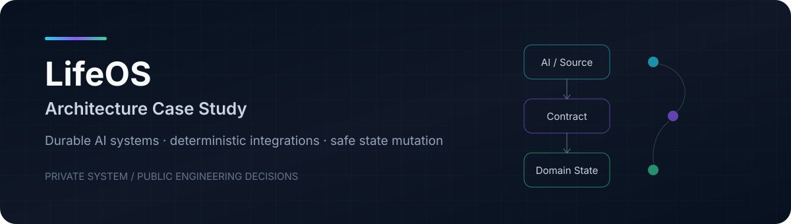

<p align="center">
  
</p>

# LifeOS Architecture Case Study

> A sanitized engineering case study about durable AI systems, deterministic integrations and safe state mutation.

**LifeOS** is a private personal operating system that coordinates multiple domains through structured state, automation and AI-assisted workflows.

This repository does **not** contain the private application, personal data, production configuration or proprietary source code. Instead, it documents selected architectural patterns, engineering decisions and reliability constraints in a form that can be reviewed publicly.

## Why this case study exists

Many AI prototypes work well while everything happens inside one conversation. The engineering problem becomes more interesting when an AI-enabled system must:

- survive across sessions;
- maintain explicit application state;
- interact with deterministic business logic;
- accept external updates safely;
- avoid duplicate mutations;
- preserve ownership boundaries;
- remain observable and recoverable.

LifeOS explores those problems in a real system rather than as an isolated demo.

## Architecture at a glance

```text
AI / external domain
        │
        ▼
Structured source state
        │
        ▼
Deterministic projection
        │
        ├── schema validation
        ├── tests
        └── contract checks
        │
        ▼
Authenticated integration boundary
        │
        ▼
Domain application service
        │
        ├── identity resolution
        ├── ownership rules
        ├── idempotency
        ├── conflict handling
        └── event generation
        │
        ▼
Revision-safe persistence
        │
        ├── canonical state
        └── event log
```

The central design principle is simple:

> **AI interprets. Deterministic software owns objective state transitions.**

## Engineering principles

### 1. Durable state beats conversational memory

Anything that must survive a chat or agent session is represented explicitly in durable state. Conversation history can provide context, but it is not the system of record.

### 2. Stable identity beats names

External entities use stable identifiers. Titles and labels may change without creating new logical entities.

### 3. Narrow integration boundaries

External systems do not receive generic write access. Each integration exposes a domain-specific contract with explicit validation and ownership rules.

### 4. Idempotency is part of the contract

Retries must be safe. Repeating an accepted operation should not silently duplicate side effects.

### 5. AI is not used where deterministic code is better

Projection, validation, identity mapping and objective transformations remain deterministic. AI is reserved for tasks that actually require interpretation or reasoning.

### 6. One canonical domain model

Integrations reuse the application's domain logic instead of implementing parallel business rules.

### 7. Avoid premature platforms

Shared infrastructure is extracted only after multiple real integrations demonstrate that the abstraction is useful.

## Example integration pattern

One implemented integration follows this pattern:

```text
Source domain
   ↓
Versioned structured state
   ↓
Deterministic adapter
   ↓
Minimal publishable payload
   ↓
CI validation
   ↓
Authenticated HTTP request
   ↓
Domain-specific endpoint
   ↓
Parse → preview → apply
   ↓
Canonical state + EventLog
```

The publishing pipeline validates configuration, regenerates the outbound projection, runs tests, verifies that generated state is current and only then publishes it.

This creates a useful separation:

- **source state** can contain domain-specific context;
- **outbound state** contains only fields accepted by the integration contract;
- **application state** remains authoritative for operational data owned by LifeOS.

## Reliability concerns

The architecture explicitly considers:

- duplicate delivery;
- stale writes;
- concurrent updates;
- ownership violations;
- invalid payloads;
- schema drift;
- partial source authority;
- noisy audit logs;
- accidental coupling between AI reasoning and state mutation.

See [Security & Reliability](./docs/security-and-reliability.md) for more detail.

## Selected engineering decisions

| Decision | Why it matters |
|---|---|
| [Durable state over chat memory](./docs/adr/001-durable-state.md) | Critical state survives model sessions and UI boundaries. |
| [Deterministic integration boundaries](./docs/adr/002-deterministic-boundaries.md) | Objective transformations remain testable and repeatable. |
| [Idempotent, ownership-aware mutation](./docs/adr/003-idempotent-mutations.md) | External publishers cannot silently corrupt canonical state. |

## What is intentionally not public

This repository excludes:

- private application source code;
- personal information;
- runtime data;
- tokens, secrets and production endpoints;
- internal prompts and private operational context;
- vendor or employer confidential information.

The objective is to demonstrate **engineering judgment**, not to publish a personal system.

## What this project demonstrates

This case study is evidence of how I approach systems that sit between **AI, software engineering and real operational state**:

`Agentic systems` · `System design` · `Integration architecture` · `Schema contracts` · `CI/CD` · `Idempotency` · `Optimistic concurrency` · `Event-driven auditability` · `Security boundaries`

## Documentation

- [Architecture](./docs/architecture.md)
- [Security & Reliability](./docs/security-and-reliability.md)
- [ADR 001 — Durable state](./docs/adr/001-durable-state.md)
- [ADR 002 — Deterministic boundaries](./docs/adr/002-deterministic-boundaries.md)
- [ADR 003 — Idempotent mutations](./docs/adr/003-idempotent-mutations.md)

---

<p align="center">
  <b>Private system. Public engineering decisions.</b><br/>
  <sub>Built to explore reliable AI integration beyond the chat window.</sub>
</p>
